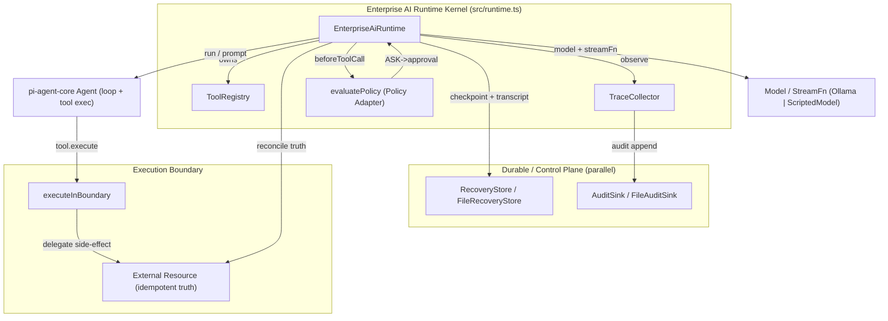

# Enterprise AI Runtime — Architecture Overview

> Generated by manual source audit (no "Archify" skill exists in this workspace).
> Every component below is verified present in `src/`. No hypothetical components.

## 1. Core Components

| Component | Source | Role | Boundary type |
| --- | --- | --- | --- |
| `EnterpriseAiRuntime` | `src/runtime.ts:100` | Facade + Run lifecycle + Recovery/Approval control points | Runtime Kernel (thin facade) |
| `ToolRegistry` | `src/tools/registry.ts:36` | Tool catalog/ownership; resolves Resource/Credential identity | Control plane (no execution) |
| `TraceCollector` | `src/trace/collector.ts:56` | Read-only execution observation (in-memory trace) | Observation |
| `evaluatePolicy` / Policy Adapter | `src/policy/adapter.ts:37` | Maps Enterprise Policy to Pi control point (ALLOW/DENY/ASK) | Policy Boundary |
| `RecoveryStore` / `FileRecoveryStore` | `src/recovery/store.ts:10`, `src/recovery/file-store.ts:15` | Durable recovery record + session transcript | Durability |
| `AuditSink` / `FileAuditSink` | `src/audit/event.ts:56`, `src/audit/file-sink.ts:13` | Append-only governance facts | Accountability |
| `ExecutionBoundary` | `src/execution/boundary.ts:52` | Isolated child-process command execution | Execution Boundary |
| `ScriptedModel` / Ollama | `src/scripted-model.ts:43`, `src/ollama/model.ts` | Model + StreamFn (test vs prod) | Model provider |
| `Skill` | `src/skills/skill.ts:14` | Capability declaration / activation (not auth) | Capability |
| `pi-agent-core` `Agent` | external dep | Agent loop, Tool execution, Agent state | Agent Kernel (owned by Pi, not Runtime) |

## 2. Architecture Diagram

## 3. Source-Verified Relationships

| Relation | Evidence | Verified |
| --- | --- | --- |
| Runtime owns ToolRegistry + TraceCollector | `runtime.ts:130,140` | ✅ |
| beforeToolCall evaluates Policy then checkpoints | `runtime.ts:199-293` | ✅ |
| Policy ASK writes durable pending approval | `runtime.ts:256-260`, `persistPendingApproval:369` | ✅ |
| Checkpoint persisted before tool (idempotencyKey) | `runtime.ts:328-354` | ✅ |
| afterToolCall advances record to `recovered` | `runtime.ts:316-322` | ✅ |
| RecoveryStore = one record per session | `file-store.ts:22` (`recovery-<sessionId>.json`) | ✅ |
| Audit is append-only, not used as state | `file-sink.ts:16` (only `append`) | ✅ |
| Execution boundary isolates child process + env | `boundary.ts:29-40,74` | ✅ |
| Session continuity = persisted messages | `runtime.ts:163-167`, `saveMessages` | ✅ |
| Run is volatile envelope; Session is durable | `runtime.ts:521` (runId per run) vs `sessionId` key | ✅ |
| Recovery reconstructs Session, not old Run | `runtime.ts:674-704` (`recover` → new run) | ✅ |

## 4. Non-Components (explicitly absent — do not assume)

- No `ApprovalManager` / `WorkflowEngine` / `Orchestrator` / `Scheduler` / `Queue` / `EventBus`.
- No new DB / Redis / Kafka / Temporal.
- Human Approval = `Policy ASK` + `DurableRecoveryRecord` + `approvalId` (Phase 37-B), not a subsystem.
- Long-Horizon = repeated Runs under one Session (Phase 38-A Design Gate结论).
